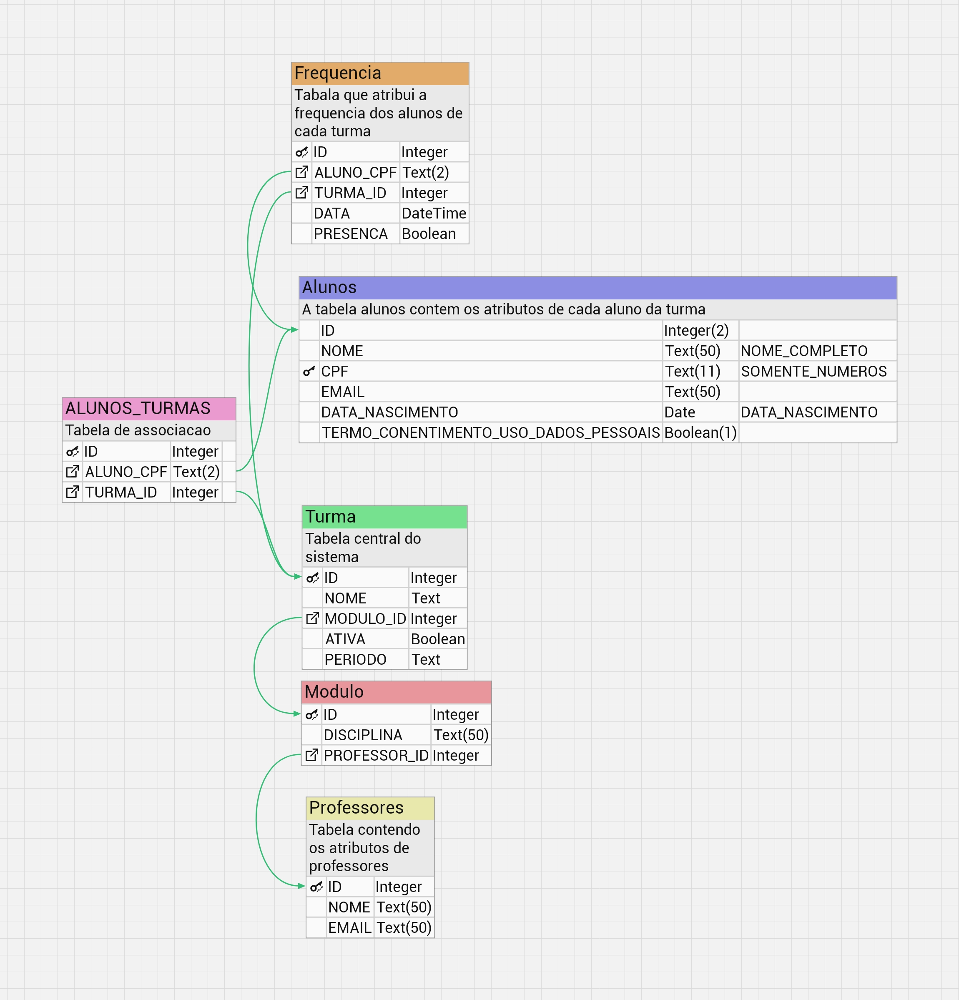

# RODAR A APLICAÇÃO

Para rodar a aplicação execue:

```bash
python -m streamlit run <main.py>
```

Página é executada no:  
http://localhost:8501/

## streamlit

- É a biblioteca escolhida pela facilidade de criar o front-end e os campos de formulários.

- [Referência](https://docs.streamlit.io/)

## SQLite3

Banco relacional local, escolhido por já ter os drivers e a sua api já serem nativas do python, e pela facilidade de lidar com as tabelas e cadastros e mostrar isso na tela do front-end

### Conexão do SQLite3

- Na pasta service, localizada na raiz do projeto, criamos o arquivo `database.py`.

- Importamos o sqlite3 que já é nativo do python
    ```py
        import sqlite3

        connect = sqlite3.connect("database.db")
        connect.cursor()  
    ```

- [Referência](https://docs.python.org/pt-br/3.13/library/sqlite3.html)

---

# Documentação do projeto

- Interface Web
	- https://github.com/ColombiniP/TCC_Automacao_e_robotica.git
	- Liguagens de porgramação 
		- [[Python]]
			- Biblioteca 
				- [[Streamlit]]
				- Datetime
	- NoSGBD
	- Banco de dados [[2- Áreas/ESTUDO/PROGRAMAÇÃO/PYTHON/Sqlite|Sqlite]]
	
- Interface Eletrônica
	- Linguagem de programação
		- [[C++]]
	- Sensor DY50
	- [[Arduino]] uno R3
	- display lcd
	- teclado
	- leds
	- caixa para montagem


## Implementação 

- [x] Configurar ambiente de desenvolvimento
	- [x] IDE vscode
	- [x] [[Python]]
	- [x] [[Git]]
- [x] Conectar com banco de dados [[2- Áreas/ESTUDO/PROGRAMAÇÃO/BANCO DE DADOS/Sqlite|Sqlite]] 
- [ ] Modelar as tabelas conforme [[Aula 11]] 
     
    


- [ ] Criar as tabelas no database.py


```SQL
CREATE TABLE Professores (
  id INTEGER PRIMARY KEY AUTOINCREMENT,
  nome TEXT NOT NULL,
  email TEXT
);

CREATE TABLE Modulo (
  id INTEGER PRIMARY KEY AUTOINCREMENT,
  disciplina TEXT NOT NULL,
  professor_id INTEGER,
  FOREIGN KEY(professor_id) REFERENCES Professores(id)
);

CREATE TABLE Turma (
  id INTEGER PRIMARY KEY AUTOINCREMENT,
  nome TEXT NOT NULL,
  modulo_id INTEGER,
  ativa BOOLEAN,
  periodo TEXT,
  FOREIGN KEY(modulo_id) REFERENCES Modulo(id)
);

CREATE TABLE Alunos (
  cpf TEXT PRIMARY KEY,
  nome TEXT NOT NULL,
  email TEXT,
  data_nascimento DATE,
  termo_consentimento_uso_dados_pessoais BOOLEAN
);

CREATE TABLE Alunos_Turmas (
  id INTEGER PRIMARY KEY AUTOINCREMENT,
  aluno_cpf TEXT,
  turma_id INTEGER,
  FOREIGN KEY(aluno_cpf) REFERENCES Alunos(cpf),
  FOREIGN KEY(turma_id) REFERENCES Turma(id)
);

CREATE TABLE Frequencia (
  id INTEGER PRIMARY KEY AUTOINCREMENT,
  aluno_cpf TEXT,
  turma_id INTEGER,
  data DATE,
  presenca BOOLEAN,
  FOREIGN KEY(aluno_cpf) REFERENCES Alunos(cpf),
  FOREIGN KEY(turma_id) REFERENCES Turma(id)
);

```

```py
import sqlite3

def criar_tabelas():
    conexao = sqlite3.connect('frequencia.db')
    cursor = conexao.cursor()

    cursor.execute('''
        CREATE TABLE IF NOT EXISTS Professores(
            id INTEGER PRIMARY KEY AUTOINCREMENT,
            nome TEXT NOT NULL,
            email TEXT
        )
    ''')

    cursor.execute('''
        CREATE TABLE IF NOT EXISTS Modulo(
            id INTEGER PRIMARY KEY AUTOINCREMENT,
            disciplina TEXT NOT NULL,
            professor_id INTEGER,
            FOREIGN KEY(professor_id) REFERENCES Professores(id)
        )
    ''')

    cursor.execute('''
        CREATE TABLE IF NOT EXISTS Turma(
            id INTEGER PRIMARY KEY AUTOINCREMENT,
            nome TEXT NOT NULL,
            modulo_id INTEGER,
            ativa BOOLEAN,
            periodo TEXT,
            FOREIGN KEY(modulo_id) REFERENCES Modulo(id)
        )
    ''')

    cursor.execute('''
        CREATE TABLE IF NOT EXISTS Alunos(
            cpf TEXT PRIMARY KEY,
            nome TEXT NOT NULL,
            email TEXT,
            data_nascimento DATE,
            termo_consentimento_uso_dados_pessoais BOOLEAN
        )
    ''')

    cursor.execute('''
        CREATE TABLE IF NOT EXISTS Alunos_Turmas(
            id INTEGER PRIMARY KEY AUTOINCREMENT,
            aluno_cpf TEXT,
            turma_id INTEGER,
            FOREIGN KEY(aluno_cpf) REFERENCES Alunos(cpf),
            FOREIGN KEY(turma_id) REFERENCES Turma(id)
        )
    ''')

    cursor.execute('''
        CREATE TABLE IF NOT EXISTS Frequencia(
            id INTEGER PRIMARY KEY AUTOINCREMENT,
            aluno_cpf TEXT,
            turma_id INTEGER,
            data DATE,
            presenca BOOLEAN,
            FOREIGN KEY(aluno_cpf) REFERENCES Alunos(cpf),
            FOREIGN KEY(turma_id) REFERENCES Turma(id)
        )
    ''')

    conexao.commit()
    conexao.close()

# Chame a função para criar as tabelas
criar_tabelas()

```


- [ ] Criar as Classes, pasta models
- [ ] Criar os Controllers, pasta Controllers
- [ ] Criar as páginas, pasta pages
- [ ] Criar interface web para exibir dados do banco e cadastrar alunos
	- [ ] Front-end
	- [x] Formulário
